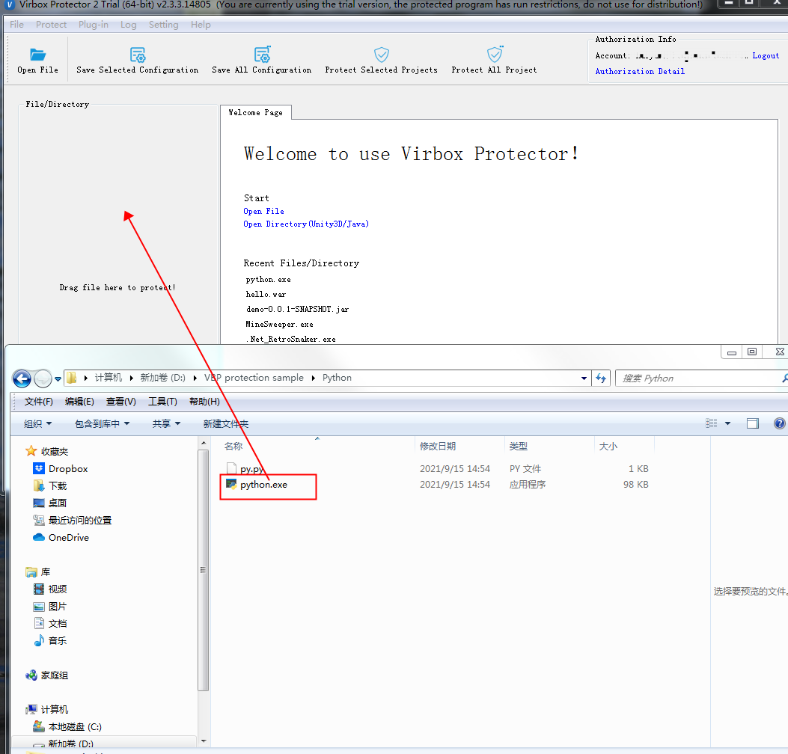
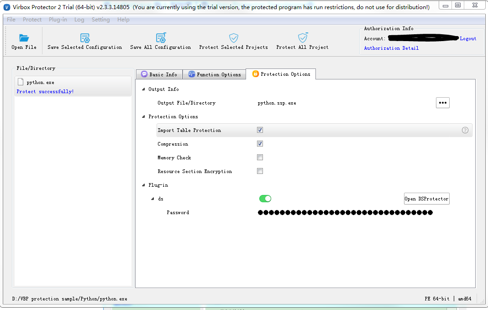
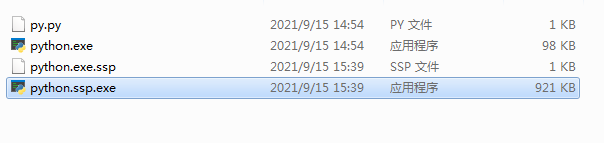
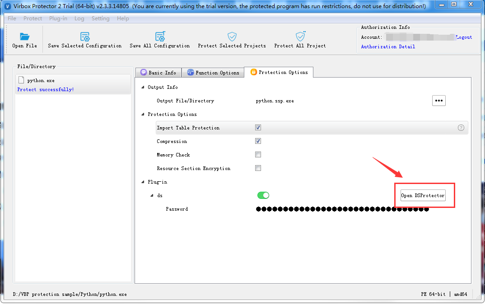
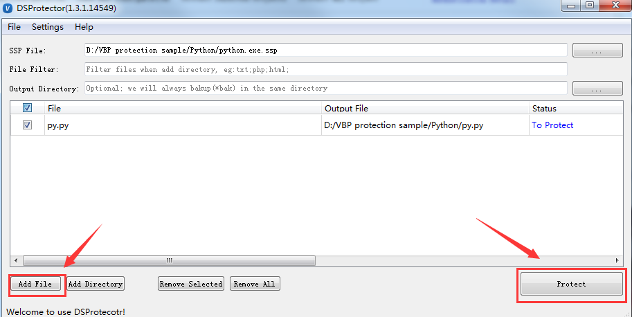
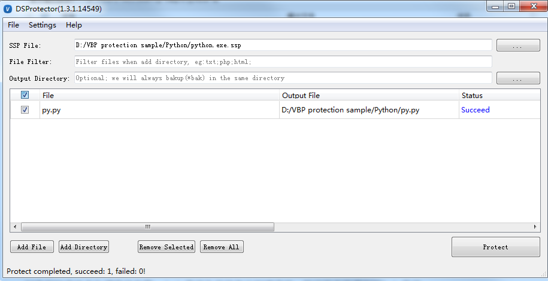
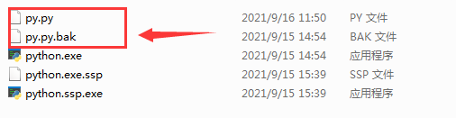

> Quick start guide for Virbox Protector User

Python, as one of high level, interpreted script program language, which widely and popular be used to develop different kind of program and application by software developers. 

As a interpreted language, the python application contains 2 kinds of python file: python.exe, the interpreter and py file: py, pyc, or pyd file, which is source code, bytecode file which will be called/interpreted by pyhton.exe when python application executed. 

The Mechanism to protect the python application: 

Using Virbox Protector, to encrypt the python.exe, the python interpreter;

Use the DS Protector, a plug in unit to protect relevant python source code: py/pyc file;

and use the protected (encrypted) python.exe and encrypted py/pyc file to replace original python.exe and py/pyc when executed.

Virbox Supports to protect the python application in following scenarios:

| **Scenario**                                             | **Support or Not** |
| -------------------------------------------------------- | ------------------ |
| Anconda2/Anconda3                                        | yes                |
| Call python module from C++/C language                   | Yes                |
| Call C++/C from py file                                  | Yes                |
| Using pyinstall/py2exe to package a py file to exe  file | Yes                |
| Convert to pyd/so/executable file by py file             | yes                |

## Pre requisition:

1. Apply trial license & download/install Virbox Protector;

2. Python application for test/evaluation is ready;

## 1.  Protect the python.exe

### 1.1  Open Virbox Protector GUI tools

 Find location of the python.exe file, and **drag** the python.exe into the Virbox Protector GUI, then Virbox Protector will parse the python. exe automatically. see picture in below:

> Note: There are 2 python file used in the protection sample application: Python.exe & py.py

Protect the selected function in "Function Option" tab, in this section, you may select the functions which you want to protect in the "Function Option" tab to protect the functions, with several encryption option to encrypt the functions: "Encryption", "No protect", "Obfuscation", "Virtualization" etc. 

"Protection Option" Tab, you may:

1. Set output path for protected file (python.exe);

2. select and set protection option to the protected file (python.exe) in file level; 

3. Switch on (Enable) DS Protector button and set password for the py/pyc file (if you don't set the password for py/pyc which DS protector used, Virbox Protector will use a password random generated:

### 1.2  Protect the python.exe

Click "Protect Selected Projects" in the menu, it will generated 2 new files as shown below:

**python.ssp.exe:** This file is python.exe after protection (we will rename the file name and use it later)

**python.exe.ssp**: this file is configuration file for protected python file;

pls backup and save the original python.exe file to another sub directory, and change the file name: python.ssp.exe to original file name: python.exe.

## 2. Protect the py/pyc file

## 2.1. Open DS Protector

Open DS protector via Virbox Protector GUI: click

Or, another way to open DS Protector from sub directory;

you can find the DS protector in \virboxprotector\bin, and open it.

## 2.2.  Protect the py/pyc file by DS Protector

Add the py/pyc which you want to protect to DS Protector GUI and click the "Protect" button on the right bottom corner, as shown in below:

when protection success, the DS Protector will show following information: 

2 files can be found in the output directory: 

py.py, this is new py file which protected successful by DS Protector; this new py file will be used together with protected python.exe later.

py.py.bak, this is your original py file, pls backup and save it. 

Till now, you have complete all protection process to protect python application; 

Use the new and protected python.exe (don't forget to change name) and protected py.py to execute your python application.

 

any questions for testing, implementation to protect python applications,

pls contact Virbox support team at:

**email:**

support@senselock.com

info@senselock.com

**Skype**: virbox_help@outlook.com
