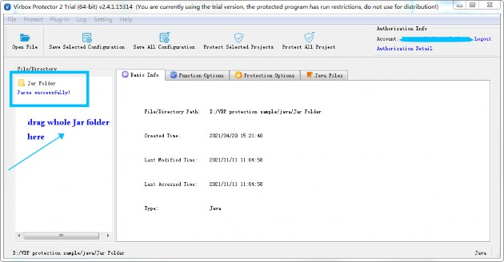
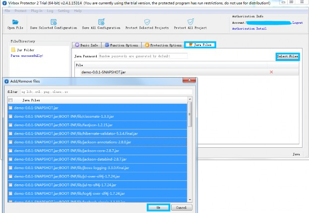
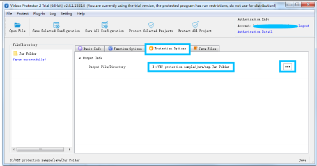
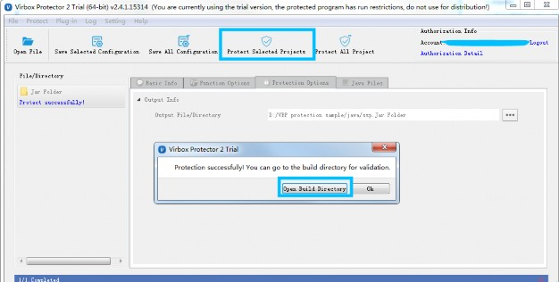
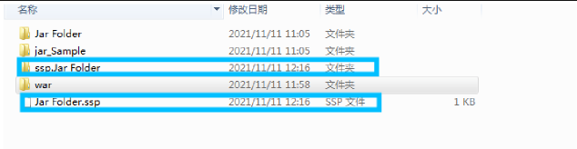
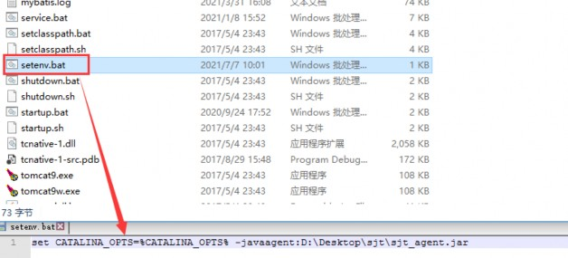
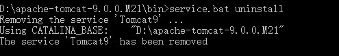
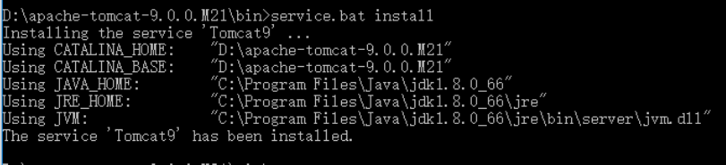
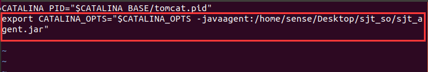
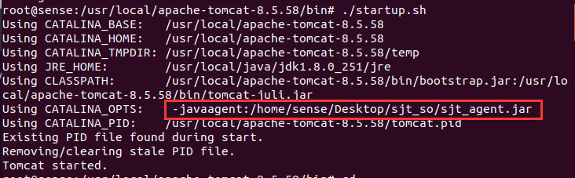

## 1 Introduction

**Virbox Protector Standalone** support to protect the Java applications, include Jar, War archives and class file and related data resource.

Virbox Protector Standalone support to protect Java application (Jar, War, or Java SDK both in GUI and CLI mode, here we use Virbox Protector Standalone GUI tools to show the protection process. and introduce how to deploy the protected Jar/War projects in Windows, Linux and macOS systems.

We use a Jar and War file as a sample to show the whole protection process step by step; and the protection process to War Archive is same. Developer may refer the Jar Protection process to protect War Project for test and evaluation also. 

 

the Operation environment is windows

The version of Virbox Protector GUI tools is 2.4.1 trial edition.

For trial license apply, install the Virbox Protector into your desktop, please refer the guide in Virbox website.

​          https://appsecurity.virbox.com/

​          https://lm-global.virbox.com/detail/virboxProtector.html

For technical support, you can contact us via email:

​          [support@senselock.com](mailto:support@senselock.com)

​          [info@senselock.com](mailto:info@senselock.com)

or via Skype:

​          [virbox_help@outlook.com](mailto:virbox_help@outlook.com)

## 2 Protection Mechanism

Virbox Protector supports developer to protect Java project with 2 kinds of protection mode, Java VME and Java BCE (2 different kind of Virbox Protector license required) 

- With Java VME protection, Developer protect and encrypt the Java's method with Virtualization, all of bytecode executed in the JVM will be convert into the instructions executed in private VM, and provides most secured environment for execution and effective to defend the retrieving and cracking by latest decompiler available in the market. Java VME is suitable for the developer who require to protect their IP/code with highly security.

- With Java BCE protection, Developer protect and encrypt the bytecode of each method of Java class file, the bytecode will be only decrypted in execution; the execution and decryption rely on relevant java agent.

## 3 Main Steps

1. Drag the **Whole folder** of Jar/War projects located  into the Virbox Protector GUI;

1. Select The Jar file to be protected in the "Java Files" tab;

1. Set output path in the "Protection Option" tab;

1. Complete to Protect the Java Project.

1. Backup the original file, rename the protected file to original file name and complete the protection process;

1. Deployment and execution

## 4 Protection Process

### 4.1 Input Jar/War file:

Drag Jar/War folder into Virbox Protector. 

Tips: The difference to use Virbox Protector BCE mode and VME mode in Operation is: With BCE mode, Drag whole folder of Jar Project into Virbox Protector. For VME mode, drag the Jar project to Virbox Protector, not drag whole folder.

Open the Virbox protector and *login* to your account,  drag the whole folder of Jar or War Project located into the Virbox Protector, in the sample case, the Jar Folder name is "Jar Folder", the Jar file we used is: demo-0.0.1-Snapshot.jar; as shown as the snapshot below:

​                                                      

Then Virbox protector will parse the Jar folder automatically. and show related information in the "Basic info" tabs, shown as snapshot above.

### 4.2 Selected and Protect the Java file via "Java Files" tabs:

Go to "Java Files"tabs,

Developer may Select those Jar/War file via Jar Files and set output path in protection Option tabs, for those Java files which need to be protected, Click "Select Files "Button", and use Ctrl+A to select all Jar file (execution performance may impact if you select all of Jar file to be protected), then click OK button on the bottom to complete selection and protection setting.

​                                                     

### 4.3 Set output path in the "Protection Option" tab;

Go to "Protection Option" tabs, set the output path, click the button (blue box on the right) to change sub directory.



### 4.4 Complete the protection

Click "Protect selected Project" to start protection; as shown as below:



Then go to the output folder, you will find a news file and new folder has been generated, in the sample, we have set the output path: D:/VBP protection sample/java



The new file which name "Jar Folder.ssp", is the configuration file which stored the protection option setting.

- The new file folder which name "ssp.Jar Folder", is the protected Jar Folder; you can find following files contained in this folder:

- demo-0.0.1.SNAPSHOT.jar: Protected Jar project;
- sjt_agent.jar: the jar agent file which will be used in future deployment;
- readme.txt: a instruction file to deployment.

## 4.5 Backup and Using protected Jar file to further deployment

Then, don't publish the original Jar file. located in "Jar Folder", 

Use the protected Jar project located in the "ssp.Jar Folder" to further deployment testing. It is not necessary to distribute the configuration file: Jar Folder.ssp, to your enduser. please keep it, if you use CLI mode to protect your .NET application, it is useful configuration file when you use Virbox Protector CLI mode later. 

In General, With Virbox Protector, with this Quick Guide, Developer may quickly to go through whole protection process to protect Jar application. for more details instruction, developer may take refer from the User Manual-Virbox Protector Standalone, or contact us directly. 

The War Project Protection process with BCE mode is same as Jar Project's protection process. 

## 5 Deployment and execution

The deployment of Jar/War Project protected with Java BCE mode is different from the deployment of Jar project with VME protection. the Jar project deployment and execution depends on the Java agent.

## 5.1 Jar Deployment

### 5.1.1 Windows Environment

Directly run the protected Jar archive 

- If sjt library and the Jar archive are located in the same directly, you can directly run the following command in the current Jar archive directly.

```
Command：

java -javaagent:sjt_agent.jar-jar ***.jar
```

- If sjt library and jar archive is not in the same directly, you need to assign the absolute directory.

```
Command: 

java -javaagent:C:\Users\test\Desktop\sjt\sjt_agent.jar -jar ***.jar
```

### 5.1.2 Linux System

Directly run the protected program:

- If the sjt library are in the same directory with Jar archive, you can run the following command in the current directory:

```
Command:

java -javaagent:sjt_agent.jar -jar ***.jar
```

- If the sjt library is not in the same directory with the jar archive, you need to assign the absolute directory:

```
Command: 

java -javaagent:/home/sense/Desktop/sjt_so/sjt_agent.jar -jar ***.jar
```

### 5.1.3 macOS environment

Directly run the protected program:

- If the sjt library are in the same directory with Jar archive, you can run the following command in the current directory;

```
Command:

java -javaagent:sjt_agent.jar -jar ***.jar
```

- If the sjt library is not in the same directory with the jar archive, you need to assign the absolute directory:

```
Command: 

java -javaagent:/Users/sense/sjt/sjt_agent.jar -jar ***.jar
```

## 5.2 War Deployment

### 5.2.1 Windows Environment

Use following ways to configure the system environment, you can select one of them:

**1.**    **Set the** *setenv.bat* **in the** *tomcat\bin* **directory:** 

Create the *setenv.bat* in the *tomcat\bin* directory, for example: 

a)    Create “*setenv.bat*” in the *tomcat\bin* directory, set the environment variable such as (absolutely path): 

​              set CATALINA_OPTS=%CATALINA_OPTS% -javaagent:sjt_agent.jar 

 

b)   Put the encrypted "war archive" into the location: *.\apache-tomcat\webapps* and start the tomcat service.

1. Start the tomcat when system service started

a)    First you need to uninstall the tomcat service, use the console command: *service.bat uninstall* to uninsall tomcat service; 



b)   Add the *sjt_agent.jar* in the parameter of *JvmOptions* in the *service.bat*, as shown as snapshot below:

 

c)    Then use the command: *service.bat.install*  in the console windows to install;

 

d)   then start "tomcat" service in the system service;

e)    put the protected "War archive" into the folder of "*.**\apache-tomcat\webapps*, then start tomcat service.

1. Start service when you using tomcat9.exe

a)    First step is to start the tomcat9w.exe

b)   add the *sjt lib* in the Java Options list, as shown in the snapshot below: 


 

c)    Execute tomcat9.exe to start tomcat service and put the protected war archive into the folder *.**\apache-tomcawebapps*, then start the tomcat service.

 

### 5.2.2 Linux System

Set **Setenv.sh**  in the tomcat directory:

 

- Create a new *setenv.sh* in the *tomcat\bin* directory, the absolute path environment variable can be set as follows:  *CATALINA_OPTS="$CATALINA_OPTS -javaagent:sjt_agent.jar*

*as shown below:*



Start tomcat service, you can view the *CATALINA_OPTS* ***parameter\*** be set



 

Put the encrypted war archive in the directory: .*\apache-tomcat\webapps*

If the War archive can be parsed correctly, the webpage can run correctly.

 

> Note: If you have configured the environment variable, the default system environment for Java execution will use the environment variable you have set, even you have assigned the ***sjt\*** library location.

### 5.2.3 macOS system

- Create a new setenv.sh in the tomcat\bin directory, the full path environment variable can be set as follows:

*CATALINA_OPTS="$CATALINA_OPTS -javaagent:/Users/sense/sjt/sjt_agent.jar*

- Start tomcat system service, you can view the parameter of *CATALINA_OPTS* set

- Put the encrypted war archive in the directory: *.\apache-tomcat\webapps*

  If the War archive can be parsed correctly, the webpage can run correctly.

 

**Let's Start Your Software Protection and Licensing Journey!**

**Virbox will help you to protect your software copyright/IP Value and Create Revenue for you.** 
