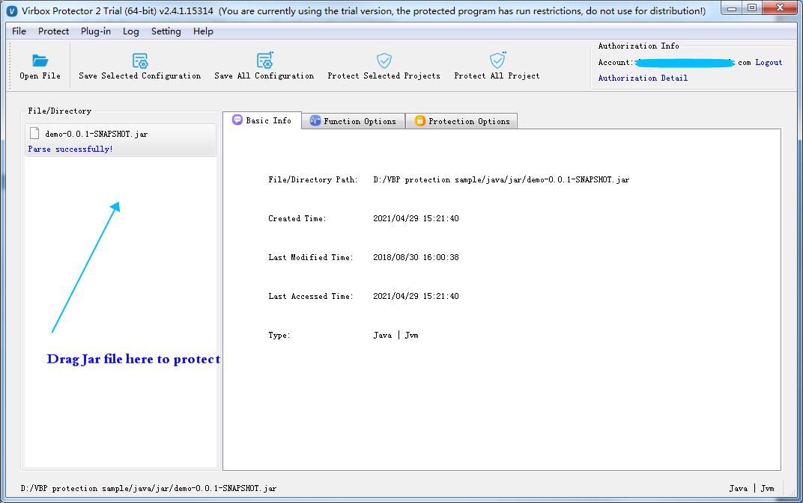
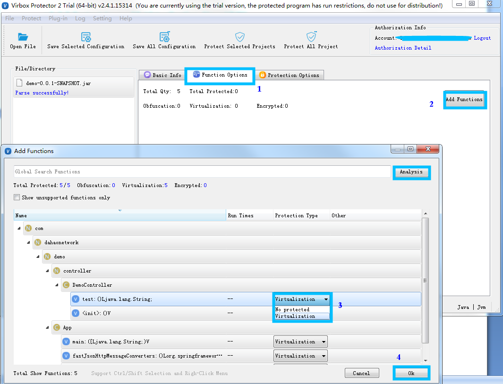
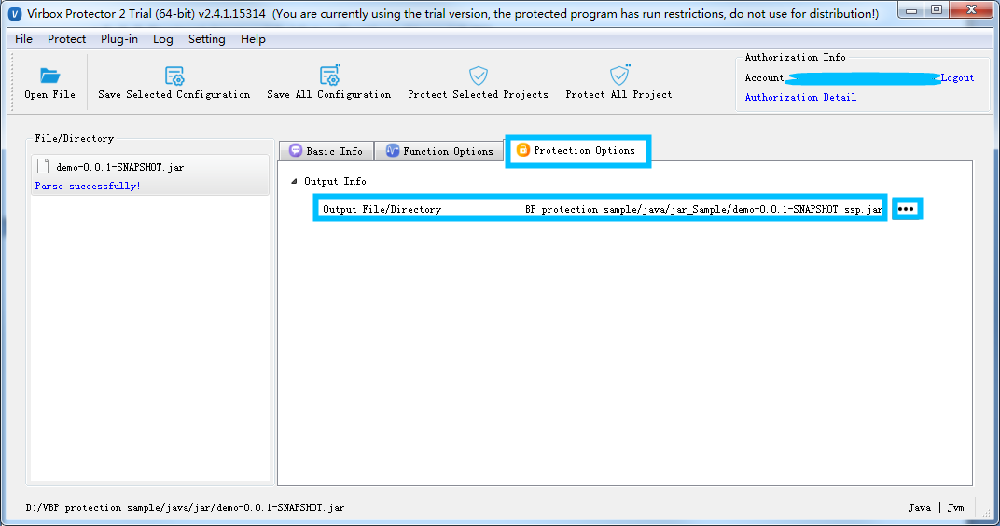
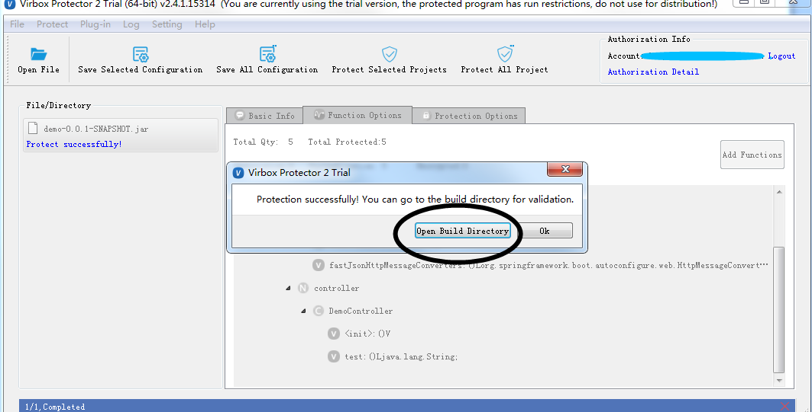
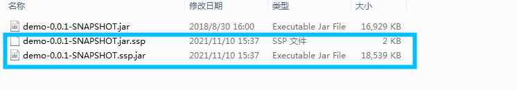
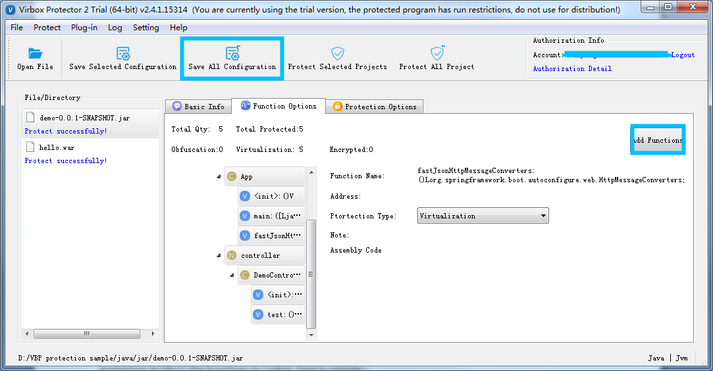
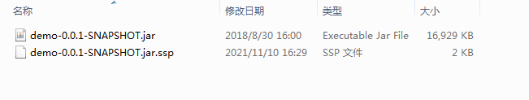
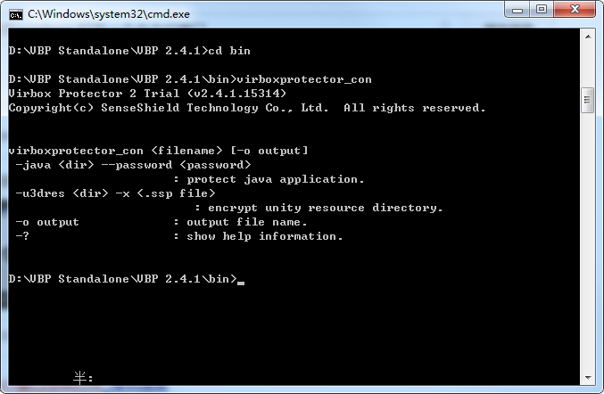

# Quick Start Guide-Protect Jar/War project with Java VME mode

# 1  Introduction

**Virbox Protector Standalone** support to protect the Java applications, include Jar, War archives and class file and related data resource.

Virbox Protector Standalone support to protect Java application (Jar, War, or Java SDK both in GUI and CLI mode, here we use Virbox Protector Standalone GUI tools to show the protection process, and also introduce the protection process by use of Virbox Protection CLI mode. Developer may freely to select GUI or CLI mode to protect their Java project with VME mode.

We use a Jar file as a sample to show the whole protection process step by step; and the protection process to War Archive is same as Jar Project process. Developer may refer the Jar Protection process to protect War Project for test and evaluation also. 

the Operation environment is windows.

The version of Virbox Protector GUI tools is 2.4.1 trial edition.

For trial license apply, install the Virbox Protector into your desktop, please refer the guide in Virbox website.

​          https://appsecurity.virbox.com/

​          https://lm-global.virbox.com/detail/virboxProtector.html

For technical support, you can contact us via email:

​          support@senselock.com

​          info@senselock.com

or via Skype:

​          virbox_help@outlook.com

# 2  Protection Mechanism

Virbox Protector supports developer to protect Java project with 2 kinds of protection mode, Java VME and Java BCE (2 different kind of Virbox Protector license required) 

l With Java VME protection, Developer protect and encrypt the Java's method with Virtualization, all of bytecode executed in the JVM will be convert into the instructions executed in private VM, and provides most secured environment for Java project's execution and effective to defend the retrieving and cracking by latest decompiler available in the market. Java VME is suitable for the developer who require to protect their IP/code with highly security.

l With Java BCE protection, Developer protect and encrypt the bytecode of each method of Java class file, the bytecode will be only decrypted in execution; the execution and decryption rely on relevant java agent.

# 3  Main Steps

1. Drag the Jar/War projects which need to be protected into the Virbox Protector GUI;

2. Protect the Jar/War functions (Method) with Virtualization: Configure the "Function Option" tab;

3. Set the Output path in the "Protection Option" tab;

4. Complete to Protect the Java Project.

5. Backup the original file, rename the protected file to original file name and complete the protection process;

# 4  Protection Process (with Virbox Protector GUI)

## 4.1 Input Jar/War file: 

Drag Jar/War file into Virbox Protector:

Open the Virbox protector, *login* with your account and drag the Jar file into the Virbox Protector, in the sample case, the Jar file we used is: demo-0.0.1-Snapshot.jar; as shown as the snapshot below:

Then Virbox protector will parse the Jar sample automatically. and show Jar file information in the "Basic info" tabs, shown as snapshot above.

## 4.2 Protect Critical methods of your Java file with Virtualization via "Function Option" tabs:

Developer may design your protection scheme to your Jar/War via Function Option and set output path in protection Option tabs, for those critical functions of Java files which need to be protected, Developer may select and define protection mode to "Virtualization": 

 

Step1, Go to "Function option" and click "**Add Functions**", click the functions (method) shown in the "Add Function" box, Virbox Protector will show more functions and list;

Step2, Select the function which you want to protect: Virbox Protector support to protect the function with "Virtualization";

Tips: 

1. Ctrl+A to select all functions, and right click, to select the protect mode, then you can quickly select all  of functions with same protection mode: Virtualization.

2. Considering the program execution performance may impact, so we don't suggest to protect all of Java Functions (methods) with "Virutalization", instead of to select those critical and important functions(Methods) to protect with "Virtualization" only.

 

Step3, Click the "OK" to finalize the "Function Option" Setting,  then go to "Protection Option" tab;

## 4.3 Set output path in the "Protection Option" tab;

Go to "Protection Option" tabs, set the output path, click the button (blue box on the right) to change sub directory.

Developer may set and define following factors in the "Protection Option" tabs

\1. Output Info: Set output path and protected Java filename, as shown in the "box " marked with blue frame

the rest of thing will be setting and protecting by Virbox Protector automatically.

## 4.4 Complete the protection

Click "Protect selected Project" to start protection; as shown as below:

Then go to the output folder, you will find a news file has been generated, in the sample, we have set the output path: D:/VBP protection sample/java sample

The new file which name demo-0.0.1-Sanpshot.ssp.jar, is the protected Jar project;

The new file which name demo-0.0.1-Sanpshot.jar.ssp, is the configuration file which stored the protection option setting.

## 4.5 Backup and rename protected Jar file

Then, you need to rename the original Jar file, un protected file to new name and keep it, don't publish this original file. and rename the "demo-0.0.1-Sanpshot.ssp.jar.", the protected Java file to " demo-0.0.1-Sanpsho.jar". then you can distribute this protected file to your enduser.

It is not necessary to distribute the configuration file: demo-0.0.1-Sanpshot.jar.ssp, to your enduser. please keep it, if you use CLI mode to protect your .NET application, it is useful configuration file when you use Virbox Protector CLI mode later. 

In General, With Virbox Protector, with this Quick Guide, Developer may quickly to go through whole protection process to protect Jar application. for more details instruction, developer may take refer from the User Manual-Virbox Protector Standalone, or contact us directly.

# 5  Protect Jar with Virbox Protector CLI tool

## 5.1 Generate configuration file by using Virbox Protector GUI tool

Drag the Jar or War project into the Virbox Protector GUI tools, and set the protection mode to the Functions (Method) of Jar (or War) project in "Function Option" tabs. (same process with Above steps)

Click "Save All Configuration" Button, as shown in the snapshot below

 

Tips: if you have use label to mark the protection mode to the functions with virtualization when you coding. then it is no necessary to generate the configuration file, you can skip this step.

 

Go to the "Output" directory, then you will find a "abc.jar.ssp" file has been generated. in the sample project, the file name in the sample is: demo-0.0.1-SNAPSHOT.jar.ssp, as shown as snapshot below:

Open the terminal window, go to the sub directory which " **virboxprotector_con**" located, and input virboxprotector_con, to view the help information

## 5.2 Protect Jar with Virbox protector CLI tools

Use following command in the terminal to protect Jar:

*virboxprotector_con <**The* *jar name which need to be protected> -o <**the* *jar name which output>*

## 5.3 Deployment

We will not describe how to deploy the protected Jar or War projects in this Quick Start Guide, in case you want to have basic knowledge to Deployment in different operation system, pls refer User Manual.

