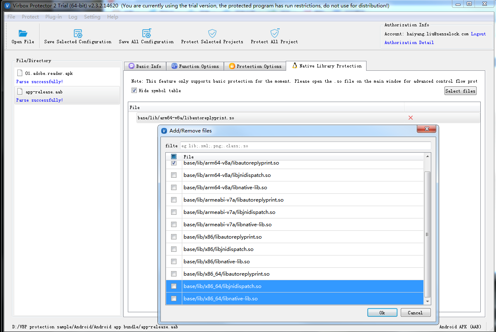

# A secure and simple way to protect your Android App Bundle project

The Android App Bundle is latest format for Android application publishing which request by Google Play. Start from this August, All of Android developer who want to go to Google app store to publish Android application will submit their application with AAB format.

There are lot of benefit for developer and enduser for new AAB format deployment, stand from developer point of view, developer also need to find a secure and simple way to secure and protect the Android Application with AAB format, here we introduce how to use Virbox Protector, a Secure and hardening tool, to protect AAB format application quickly.

Using Virbox Protector, developer will quickly complete the encryption/protection process to the AAB application and without additional coding in local premise and no need to upload your application to cloud and no any leaky risk for your android application to upload to cloud.

### **1.Prerequisites to protect your Android App bundles**

A sample project of Android App bundle has been built;

Apply a trial license and download and install the Trial package of Virbox Protector from Virbox website.

or, a formal release Virbox Protector (Android Edition) available in your desktop;

> Note: Compare with those online mobile application protection/hardening solution in the cloud, The main difference between Virbox Protector and these tools is: Virbox Protector is on premise protection tool installed in your local desktop, no need to upload your mobile application to cloud. and also No any No. of limitation to your application you plan to protect. you can use the Virbox Protector in your local machine to protect any applications if you want (with valid license)


### **2.Android App Bundle Protection Proces**

In this case, we use the Virbox Protector (GUI) and a built Android App bundle file as a sample to introduce the AAB protection process, The CLI mode of Virbox Protector also available and support to protect android application in AAB format, if you want to protect you AAB with CLI mode, you also can find the guidance here.

#### **2.1. Open The Virbox Protector and drag your AAB application into the Virbox Protector**

Go to the directory which Virbox Protector located, find the virboxprotector.exe and execute it (virboxprotector.exe can be found in the /bin sub directory).

You will have 2 ways to add your AAB format file into the Virbox Protector, one way is drag your application into Virbox Protector GUI tool directly;
another ways is: click the File--Open File which located in the Main menu of Virbox Protector, Open file to select the file (AAB format) which you plan to protected;
Then Virbox Protector will start parsing the application automatically and show the basic information for the application which parsing successfully, As shown as the snapshoot below:


#### **2.2.Protection option setting**

In the "Protection Option" tag, developer can select and setup "Protection Option to your Android App bundle project in general, includes conventional protection/encryption option setting to defense cracker and Signature setting for your Android application publishing in Google play and developer also can specify the output path for protected project in the "Protection Option" tag

Protection Options

Virbox Protector support following protection functions to defense hacker to use debug tool and reverse-engineering tool to crack your application, and you may simply to click and select those function to protect your AAB application, as shown in below figure


`Dex Encryption`: To compress and encrypt the .dex file in general, it is NOT recommend to select this protection feature in case you plan to enroll your apps in Google Play; Instead with select the "Virtualization" from the "Functions Protection" Tag to protect the functions inside of the dex file

`Anti-Debugging`: click and select this feature, the protected application will exit directly when hacker using IDA or other debugger tool to debug your apps;

`Anti-Inject`: to prevent the other process to attach in your application for debugging or injection;

`Signature Check`: Click and select here to verify signature and set your signature in "Sign Setting" in below: input your signature file and password in keystore;

`Emulator Check`: Select to detect emulator environment;

`Root Check`: to prevent application running in the rooted environment;

Signature Setting

you need to sign your signature automatically if you have click and select "Signature Check" in above selection:

Click "Enable Sign" to Enable Signature; then you can input your keystore file, keystore password accordingly, the key alias and password as optional;

With above signature setting, Your ABB project will be signed after protected completed.

> Note: If sign disable, you need to sign manually;


Click "Output File/Directory" to set output file and path.

#### **2.3. Function Option setting**

Besides to protection in general level, Virbox Protector, also support developer to protect Android APK and ABB file to functions level, developer may select/specify those critical functions contains important algorithm, IP which need to protect and set the protection mode to these functions in "`Function Option`" tag.

Virbox Protect provide "Virtualization" encryption technology to the functions in the dex file, which enhance the security to these protected functions.

Virtualization of Dex, which process the Dalvik bytecode with the virtualization technology, and convert the bytecode into private instruction set executed in the self defined Virtual Machine, then interpreted and executed in the VM environment in Native layer.

How to quickly select the functions:

> Shortcut:
> `CTRL+A`: Select all functions;
> `CTRL+ left click of mouse`: select specified functions;
> `CTRL+Shift+left click of mouse`: Select multiple funcitons;
> `Right click`: Select protection mode to these selected functions;


#### **2.4. Native Library Protection: Protect .so libs**

Developer can select the .so lib which need to be protect in the "Native Library Protection" Tag, developer can protect .so libs here with Compression protection. If developer want to protect to the functions contains in the .so libs, you may go back to the "Function Option" tag.




#### **2.5. Complete Protection Process**

When you complete above "protection" setting, click the "`Protect Selected Project`" in the main menu to generate the protected AAB project file.

There will be 2 file can be found in the output sub-directory:

`xxx.ssp.aab`: this is protected AAB project file, you need to save the original, unprotected AAB project file to another directory and change this protected project file name to original project name, this file can be used to published in Google play later.

`xxx.aab.ssp`: this is configuration file. you can save it and update next times.

### **3. Use the Virbox Protector Command Line to protect the AAB project file.**

Virbox Protector, support developer to protect AAB with command line mode, developer use following command to protect their project:`virboxprotector_con`

#### **3.1. Generate configuration file**

Use the Virbox Protector GUI tools to generate the configuration file, if no configuration file has been found, then the protected AAB project file will not be signed on default;

#### **3.2. Open terminal in the windows**

go to the sub-directory which "virboxprotector_con" located, input: `virboxprotector_con` to view help information before you use CLI mode to protect your project;

#### **3.3. Protect your AAB project files**

Command to Input:

```
virboxprotector_con {the AAB project which need to be protected} -o {output AAB project}
```

then you will find related project file has been generated, change project file name to original project name. use the project file to be publish in Google Store later.


### **4. Note to publishing Protected AAB project in Google Play**

When you plan to enroll & publish your AAB project in the Google Play, pls keep in mind to follow points:

\1. Don't select the "Dex Encryption" in the "`Protection Option`" tag, instead, go back to "`Function Option`" tag and use "Virtualization" mode to project these functions in the dex file which need to be projected；

\2. Sign Check

Google play provides 5 kinds of option in "`App signing Preferences`" (You may find it under "`Setup--App integrity`" , developer may choose either of 2 options in below to sign for Google play publishing;

2.1 If the developer click and select "Sign Setting" in the "`Protection Option`" Tag and also input the key and password in the keystore, then you need to select one of them from following 3 options in Google "`App signing preferences`", according to your key status:

"Use the same key as another app in this developer account"

"Export and upload a key from Java Keystore"

"Export and upload a key (not using Java keystore"


Pls DO NOT Select the option:

```
"Let Google manage and protect your app signing key (recommended)", since no apps can be signed twice;
```

2.2 If you want to use Google to manage your app signing key, pls do NOT to click and select "Signature Check" and "Sign Setting" in the "`Protection Option`" Tag;

then you can select the option in the "`App signing preferences`" which under the "`Setup--App integrity`":

```
"Let Google manage and protect your app signing key (recommended)"
```

Let's try to protect your Android App Bundle's project with Virbox Protector now, it is on premise solution to protect your APK and AAB project, highly secured and no leaky risk compared with other cloudy solution;

Any question, you can get support from:

email: info@senselock.com

skype: virbox_help@outlook.com