<<<<<<< HEAD
# Best Practice to protect Android Apps

## The Challenge and security issue of Android apps (apk, aab & other types of Android apps)

### The security issue of Android Apps:

Like with the cracking and hacking behavior to other applications, usually, the third party threat actor use decompiler, reverse engineering tool to crack  the Android apps in 2 aspects:

#### Static analysis: 

Use the decompiler and reverse engineering tool to analysis Android apps, to get those sensitive information, strings of class, fields, functions/methods, and finally to get  your source code, code logic, sensitive data, resource, etc.

#### Dynamic analysis: 

The third party threat actor to analysis the runtime environment when application executed, for further memory dump,  inject part of malicious code and repackaging your Android apps for reusing.  In practically, those static and dynamical analysis and tool will help the third party threat actors to:

### Reverse engineering

Usually developer use Java/Kotlin to build the  native Android Apps.,  and compile and packed with dex file  in the Apk package.  The dex file contains the critical information, such as,  the class, methods, members and even contains the source file name, via dex file, the third party cracker may easily to decompile and get source code which developer invest lot of effort to build it.

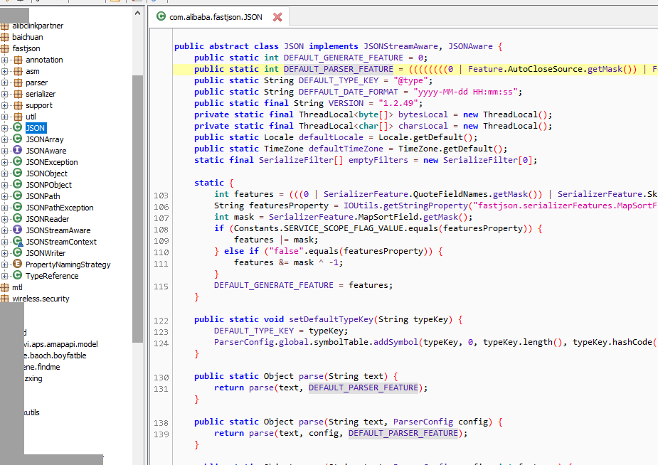

[^Decompiling the dex file]: Decompiling the dex file.

### Crack/Steal the Code logic

Without hardening and protection to Android Projects, it is easier to get the critical code logic by decompiling which makes  lost revenue, investment and effort to project to developer.

### Repackaging/Tampering Android Apps.

Cracker may use the "apk tool" to decompile the dex file in the Apk file to be the "smali" code, by modify/edit the "smali" code, it may easy to edit/modify the code logic and insert malicious code and repackage to new Apk. which cause revenue lost or other negative impact to your business.

Here is snapshoot of java code by using the jadx tools decompiling:

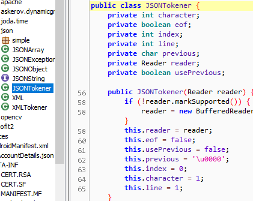

smali code

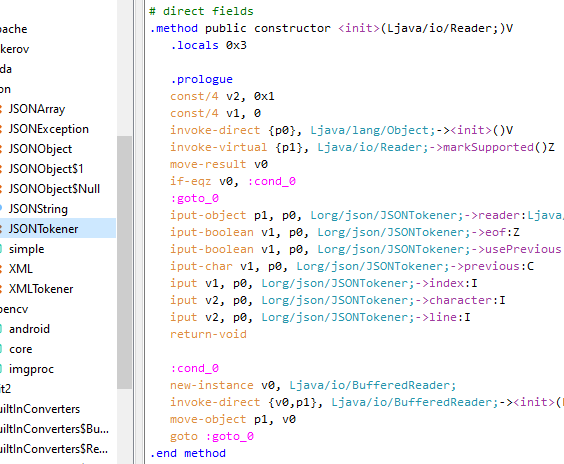

### Crack/Steal resource and data assets

For some Android apps: Games, GIS apps, developer also invest lots to create the resource assets, pictures, audio, video files attached in the apps.  and for Android Apk file, it is the typical zip format file, and the third party may get apk resource, audio, video, profile easily.

## Protect/hardening the Android apps:

## The Total Solution from Virbox Protector

Integrate with multi layer encryption/protection technology, Virbox Protector supports Android developer:

​	Design tailor-made protection scheme to their Android apps and complete protection and hardening their Android apps easily and quickly, even for those developers without the hardening experience. 

​	Effectively to defend static analysis to apps and dynamic analysis in runtime to prevent android apps from decompiling, reverse engineering, tampering and repackaging. 

Here is overview to Virbox Protector solution to protect/hardening Android Apps: Apk, AAR, AAB, .so, Android Unity3D, 

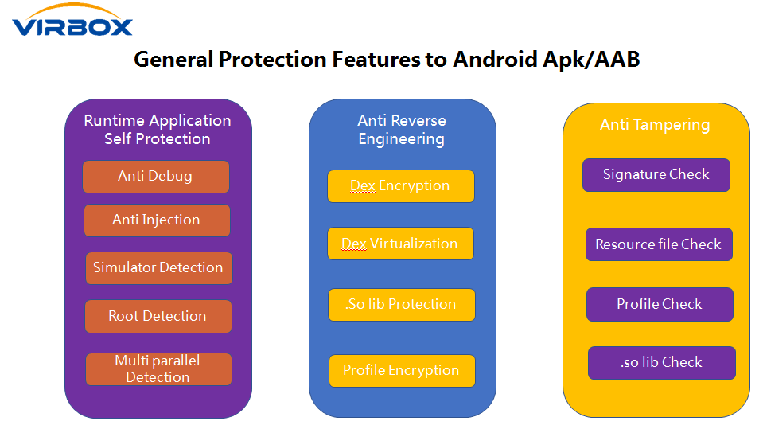

### Runtime application self protection

With Virbox Protector hardening solution, Developer has capable to implement Runtime application self protection to the Android apps. RASP, which means when application start to execution in Runtime environment, the apps protect itself to prevent from the possible debugging and analyzing, memory dump behavior by third party. and also to defend injection, or other tampering action. and also detect if the apps running in the simulator or root environment which to prevent further debugging, cracking actions.

| Protection option               | Description                                                  |
| ------------------------------- | ------------------------------------------------------------ |
| Anti debugging(Debug detection) | To prevent android apps being debugged by third party debugger, suchas IDA Pro, gdb, jeb etc. in case the debugging has been detected, the apps will be stopped and exited. |
| Anti Injection                  | To prevent apps being attached by "ptrace", inject to .so libs, and detect the hook etc; |
| Emulator Detection              | When the apps running in the emulator environment has been detected, then exit execution; to prevent possible debugging or analysis |
| Root Detection                  | When the apps running in the "Root" environment has been detected, then exit execution; to prevent possible debugging or analysis |
| Multi Parallel Detection        | when multi parallel environment has been detected, the apps will exit execution; |

As shown as above Runtime application self protection in below snapshot, developer just click and select those function to accomplish protection setting, no additional coding required.

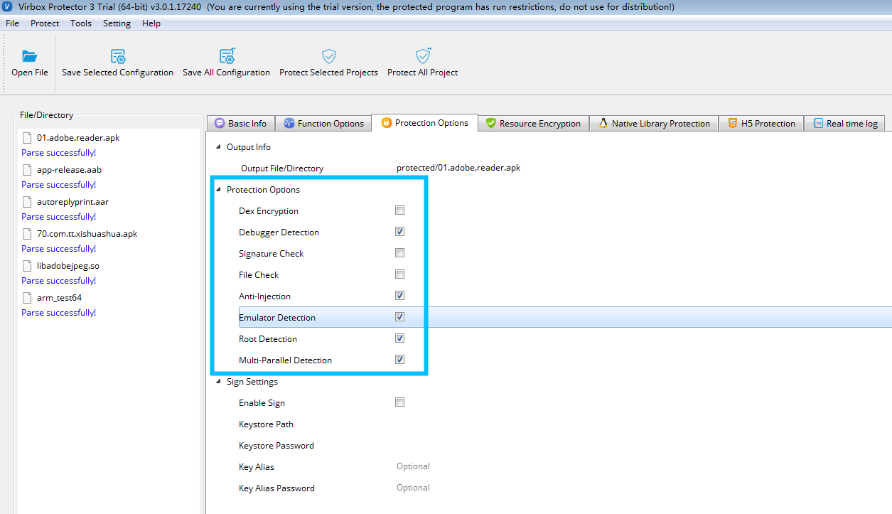

### Anti Reverse Engineering

Developer also may click and select following protection options to prevent the dex file, .so libs, scripting language and function/methods being decompiled, stolen, reverse engineering. etc.

| Protection Option                        | Description                                                  |
| ---------------------------------------- | ------------------------------------------------------------ |
| Dex Encryption                           | To encrypt and hide all of the dex file contained in the apk, to prevent the third party to use "jadx", "jeb" , the decompiler tool to decompile the dex file; |
| Dex Virtualization                       | Developer may select those critical/important function/methods in the dex file and use "Virtualization" protection option to protect those methods. and convert/transform the code and execute in the self define Virtual machine environment. which effectively to prevent the memory dump to reverse the source code. The critical functions/methods can be: the license code check algorithm implementation, an innovative optimization method, or any of code/algorithm which value worth important need to protect. |
| Encryption to resource and data assets   | Encrypt the resource file, data assets, profiles in the apk, to prevent those resource file being stolen and used. |
| Protect .so libs                         | Protect to specified .so libs in the Apk file, to encrypt the code section, which to prevent the IDA Pro tools to de-assembling, decompiling. |
| Protect .so libs (hide the symbol table) | Hide the export functions in the .so libs, to encrypt the ELF relocatable which to prevent the .so libs unpacked. |

**Developer may select those "Anti Reverse Engineering" Protection option in following tabs as shown as below:**

Dex Encryption, Encryption to Resource and data assets, Protect so libs, Encryption to the scripting  language (if any)

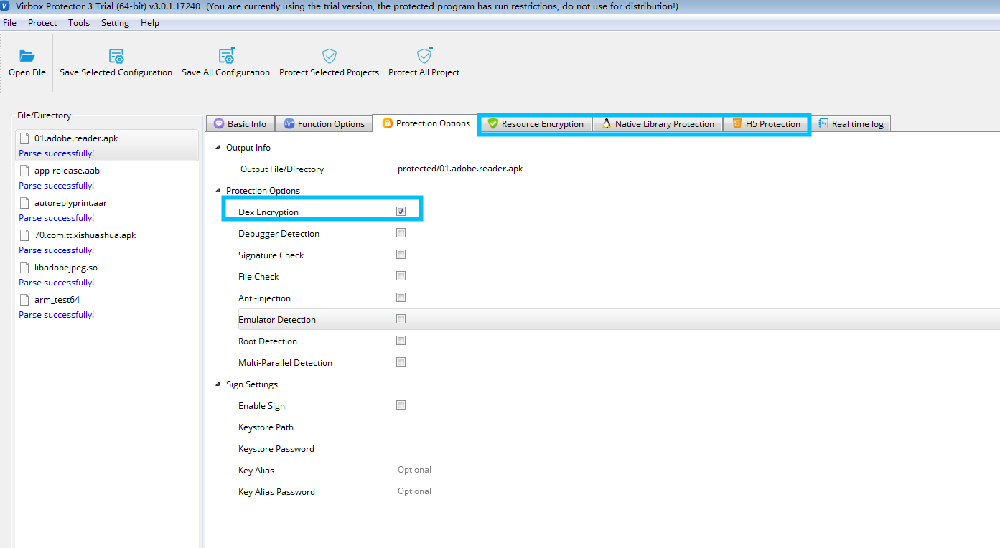

For Dex Virtualization (Function/method Virtulization) Setting, Developer may select and enable protection option in the "**Function Option**" tab, Select those critical & Important methods to protect:

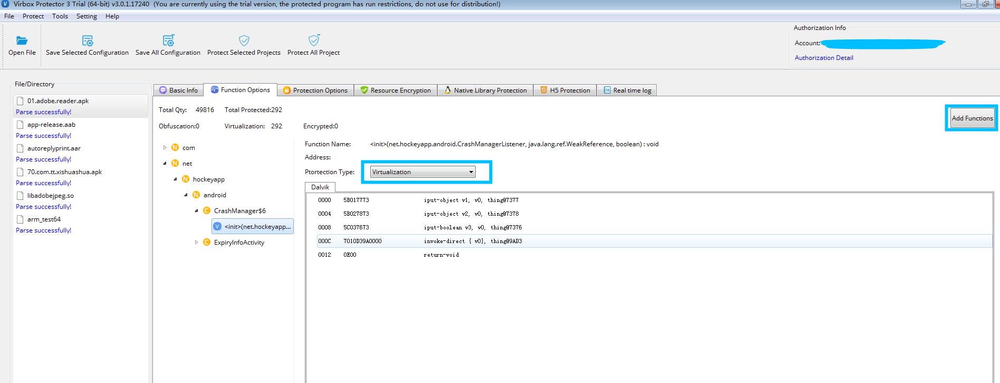

**The Result by using Dex Virtualization**

**Before Dex Virtualization**

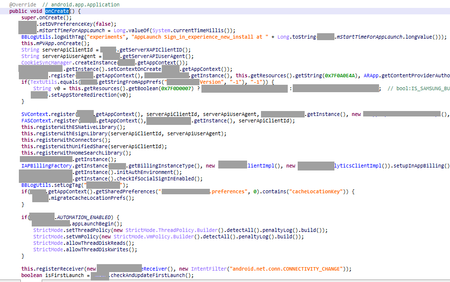

**After Dex Virtualization**

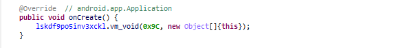

After selection "Virtualization" protection option, the program will jump into self defined interpreter to execute the method (see the method "vm_void" above)

### Anti-Tampering

Select these anti tampering protection options, the protected program will check code integrity and file integrity which to prevent the application being tampered and repackaging.

| Protection Option | Description                                                  |
| ----------------- | ------------------------------------------------------------ |
| Sign Check        | To check/verify the developer signature in the Apk file to prevent the re signed after repackaging by third party illegally. |
| File Check        | To check/verify the resource file, scripting, .so libs, to prevent those file in the Apk being tampered for repackaging. |

Developer set these 2 Anti Tampering protection options here:

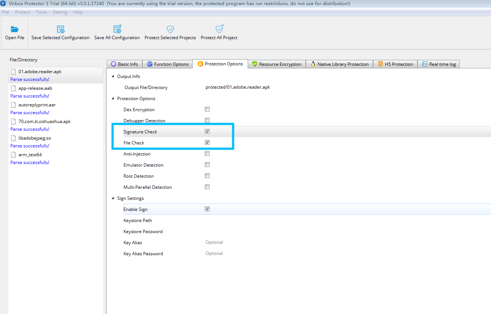

### Enable to sign the protected Apk files

also, one thing remind, when you design and complete every function/protection option setting, before you start the protection process, you need to click to enable sign setting for protected apk also and input: 	Keystore path,

​	Password, 

​	Key alias, 

​	Key Alias Password etc.

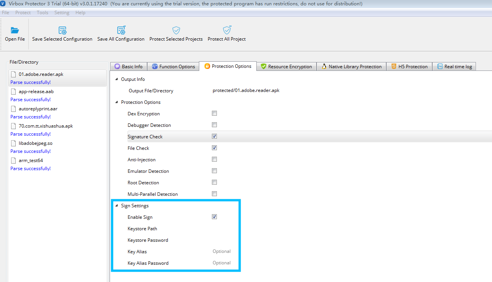

### Click to start & complete the protection process.

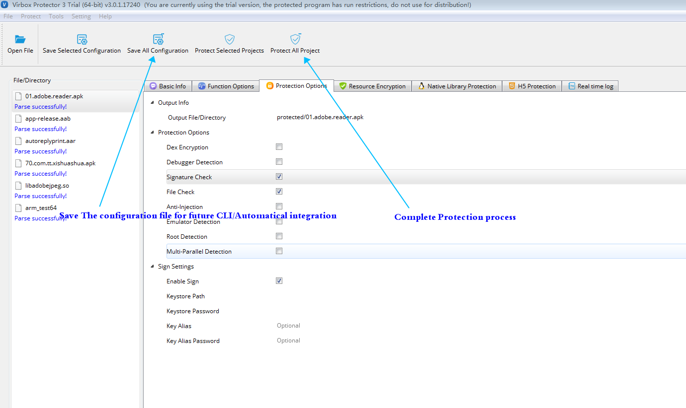

#### Enjoy & Cheers:)

For technical issue/support for 

[https://appsec.virbox.com/]: 

please contact us at: 

support@senselock.com

### Support Environment

#### Operation System

Android 4.0 and above

#### CPU Architecture:

ARM V7, V8, X86, X64

#### Device type:

Android tablet, Android mobile, Emulator,  etc.

=======
# Best Practice to protect Android Apps

## The Challenge and security issue of Android apps (apk, aab & other types of Android apps)

### The security issue of Android Apps:

Like with the cracking and hacking behavior to other applications, usually, the third party threat actor use decompiler, reverse engineering tool to crack  the Android apps in 2 aspects:

#### Static analysis: 

Use the decompiler and reverse engineering tool to analysis Android apps, to get those sensitive information, strings of class, fields, functions/methods, and finally to get  your source code, code logic, sensitive data, resource, etc.

#### Dynamic analysis: 

The third party threat actor to analysis the runtime environment when application executed, for further memory dump,  inject part of malicious code and repackaging your Android apps for reusing.  In practically, those static and dynamical analysis and tool will help the third party threat actors to:

### Reverse engineering

Usually developer use Java/Kotlin to build the  native Android Apps.,  and compile and packed with dex file  in the Apk package.  The dex file contains the critical information, such as,  the class, methods, members and even contains the source file name, via dex file, the third party cracker may easily to decompile and get source code which developer invest lot of effort to build it.

[^Decompiling the dex file]: Decompiling the dex file.

### Crack/Steal the Code logic

Without hardening and protection to Android Projects, it is easier to get the critical code logic by decompiling which makes  lost revenue, investment and effort to project to developer.

### Repackaging/Tampering Android Apps.

Cracker may use the "apk tool" to decompile the dex file in the Apk file to be the "smali" code, by modify/edit the "smali" code, it may easy to edit/modify the code logic and insert malicious code and repackage to new Apk. which cause revenue lost or other negative impact to your business.

Here is snapshoot of java code by using the jadx tools decompiling:

smali code

### Crack/Steal resource and data assets

For some Android apps: Games, GIS apps, developer also invest lots to create the resource assets, pictures, audio, video files attached in the apps.  and for Android Apk file, it is the typical zip format file, and the third party may get apk resource, audio, video, profile easily.

## Protect/hardening the Android apps:

## The Total Solution from Virbox Protector

Integrate with multi layer encryption/protection technology, Virbox Protector supports Android developer:

​	Design tailor-made protection scheme to their Android apps and complete protection and hardening their Android apps easily and quickly, even for those developers without the hardening experience. 

​	Effectively to defend static analysis to apps and dynamic analysis in runtime to prevent android apps from decompiling, reverse engineering, tampering and repackaging. 

Here is overview to Virbox Protector solution to protect/hardening Android Apps: Apk, AAR, AAB, .so, Android Unity3D, 

### Runtime application self protection

With Virbox Protector hardening solution, Developer has capable to implement Runtime application self protection to the Android apps. RASP, which means when application start to execution in Runtime environment, the apps protect itself to prevent from the possible debugging and analyzing, memory dump behavior by third party. and also to defend injection, or other tampering action. and also detect if the apps running in the simulator or root environment which to prevent further debugging, cracking actions.

| Protection option               | Description                                                  |
| ------------------------------- | ------------------------------------------------------------ |
| Anti debugging(Debug detection) | To prevent android apps being debugged by third party debugger, suchas IDA Pro, gdb, jeb etc. in case the debugging has been detected, the apps will be stopped and exited. |
| Anti Injection                  | To prevent apps being attached by "ptrace", inject to .so libs, and detect the hook etc; |
| Emulator Detection              | When the apps running in the emulator environment has been detected, then exit execution; to prevent possible debugging or analysis |
| Root Detection                  | When the apps running in the "Root" environment has been detected, then exit execution; to prevent possible debugging or analysis |
| Multi Parallel Detection        | when multi parallel environment has been detected, the apps will exit execution; |

As shown as above Runtime application self protection in below snapshot, developer just click and select those function to accomplish protection setting, no additional coding required.

### Anti Reverse Engineering

Developer also may click and select following protection options to prevent the dex file, .so libs, scripting language and function/methods being decompiled, stolen, reverse engineering. etc.

| Protection Option                        | Description                                                  |
| ---------------------------------------- | ------------------------------------------------------------ |
| Dex Encryption                           | To encrypt and hide all of the dex file contained in the apk, to prevent the third party to use "jadx", "jeb" , the decompiler tool to decompile the dex file; |
| Dex Virtualization                       | Developer may select those critical/important function/methods in the dex file and use "Virtualization" protection option to protect those methods. and convert/transform the code and execute in the self define Virtual machine environment. which effectively to prevent the memory dump to reverse the source code. The critical functions/methods can be: the license code check algorithm implementation, an innovative optimization method, or any of code/algorithm which value worth important need to protect. |
| Encryption to resource and data assets   | Encrypt the resource file, data assets, profiles in the apk, to prevent those resource file being stolen and used. |
| Protect .so libs                         | Protect to specified .so libs in the Apk file, to encrypt the code section, which to prevent the IDA Pro tools to de-assembling, decompiling. |
| Protect .so libs (hide the symbol table) | Hide the export functions in the .so libs, to encrypt the ELF relocatable which to prevent the .so libs unpacked. |

**Developer may select those "Anti Reverse Engineering" Protection option in following tabs as shown as below:**

Dex Encryption, Encryption to Resource and data assets, Protect so libs, Encryption to the scripting  language (if any)

For Dex Virtualization (Function/method Virtulization) Setting, Developer may select and enable protection option in the "**Function Option**" tab, Select those critical & Important methods to protect:

**The Result by using Dex Virtualization**

**Before Dex Virtualization**

**After Dex Virtualization**

After selection "Virtualization" protection option, the program will jump into self defined interpreter to execute the method (see the method "vm_void" above)

### Anti-Tampering

Select these anti tampering protection options, the protected program will check code integrity and file integrity which to prevent the application being tampered and repackaging.

| Protection Option | Description                                                  |
| ----------------- | ------------------------------------------------------------ |
| Sign Check        | To check/verify the developer signature in the Apk file to prevent the re signed after repackaging by third party illegally. |
| File Check        | To check/verify the resource file, scripting, .so libs, to prevent those file in the Apk being tampered for repackaging. |

Developer set these 2 Anti Tampering protection options here:

### Enable to sign the protected Apk files

also, one thing remind, when you design and complete every function/protection option setting, before you start the protection process, you need to click to enable sign setting for protected apk also and input: 	Keystore path,

​	Password, 

​	Key alias, 

​	Key Alias Password etc.

### Click to start & complete the protection process.

#### Enjoy & Cheers:)

For technical issue/support for 

[https://appsec.virbox.com/]: 

please contact us at: 

support@senselock.com

### Support Environment

#### Operation System

Android 4.0 and above

#### CPU Architecture:

ARM V7, V8, X86, X64

#### Device type:

Android tablet, Android mobile, Emulator,  etc.

>>>>>>> 8ae68f74b91666deb5c64e9e9861725607b56966
Virbox Protector: Protect & Hardening your android apps on your premise, offline, no restriction apps version, size, volumes of subscriber activated. etc. 