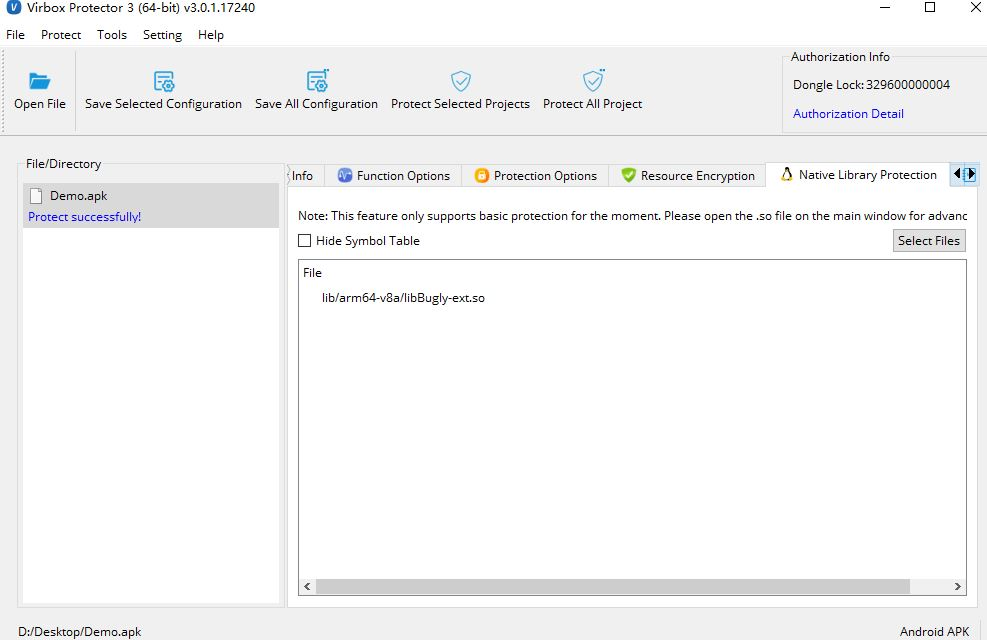

# How to quickly evaluate Protection Shielding performance to your application

--Use decompiler to evaluate shielding performance when you completed your Mobile Apps shielding/hardening

 

With Virbox Protector shielding/hardening features,  developer  has capability to safeguard their application, project to defend the third party attacker to use decompiler in reverse engineering and tampering their project. 

Usually, when developer complete protection/shielding configuration and process (By GUI or CLI tool). developer need to check and evaluate the protection result and see if the App  is safety enough to detect/defend the potential attack behaviors.

in this article, we will briefing the process and steps by use of decompiler to check if your protection configuration is strong enough to defend the decompiling and reverse engineering. if not, you can back and update your configuration (to select more functions, protection option) to enhance and improve your protection scheme. 

## **Potential threaten**

Usually, crack/attacker will take following way to attack your mobile project:

**Static analysis,** use decompiler to analysis and get the source code, the critical algorithm, data resource by searching key word, method/class name,  to identify the critical code position in the project. With those way to crack and get source code of algorithm. etc.  analyze it, modify it, debug it, etc. or for further tampering/repackaging your project later.

**Dynamic Analysis**,  At runtime, cracker use variety of techniques, such as debug tools,  to analyze trace and modify  your application when execution, Today, it is easier than ever before for a malicious user to deploy various techniques like jailbreaking, rooting, hooking, and more in order to steal decryption keys, intercept communication to servers and more.

Next, we will take a android apk as a  example to show 

1. How easily to decompile and analysis original sample apk by use of: `Jadx` GUI tool (you may use other decompiler you familiar or frequently used) and `IDA pro` 

2. The protection process to the method, resource, .so libs contained in the sample apk above by use of Virbox Protector.

3. Use same decompiler and reverse engineering tool analysis and check if the protected "Component" in the sample apk can be decompiled and reverse to source code.

## Decompile the original sample projects

The sample apk here we used `demo.apk` is normal Apk package (you also can use AAB or other types of mobile or native language apps to verify the shielding performance if you want) which consists of  `Dex` file, soruce code, resource, `.so` libs. everything in one package. 

The original `demo.apk`, without any of code obfuscation, resource and libs encryption of protection. so when we use the decompiler `Jadx`GUI tool, a open source decompiler to analysis this apk. all source code, resource, libs will be clearly be decompiled. 

First, Open the  `Jadx` GUI tool and drag the  `demo.apk` into the `Jadx` GUI tool,  then `Jadx` will parse all of functions, dex file, resource into source code. for example, the method name "messengerUtils", all of source code has been parsed, as shown as below snapshot:

For resource file, we use the `test.txt` a resource file, as a sample and use the `Jadx` to decompile. the parsing result like this:

For the native library contained in the demo.apk. we use the `IDA pro` (you may use other decompiler if you want) to analysis the native library. It shown clearly structure of source code and function's name.

From the decompiling above, Without the shielding/protection to original sample applications (Apk, or AAB, AAR, or iOS project), by use of decompiler or reverse engineering tool, it is quite easy to third party attacker to get  all of source code, methodology of functions, code logic,  data resource for further tampering, repackaging.

## Protection process by use of Virbox Protector

We use the same sample apk to show how to protect the same functions, resource, libs which source code has been decompiled by `Jadx GUI` tool and `IDA pro`.

First drag the `demo.apk` into Virbox Protector GUI tool, after parsing the `demo.apk`, Virbox Protector GUI tool will show as below. then next we will protect the functions, resources, native library respectively in relevant tabs.

1. Protect the functions in "Function Option" tabs with "virtualization"

   First, Go to the "Function Option" tabs  find `messengerUtils` functions, and select and use the "Virtualization" (Code of Virtualization) to obfuscate this functions, as shown as snapshot in below:

   

   

2. Protect the resource (`asset/test.txt`) in "Resource Encryption" tabs:

   With Virbox Protector, developer may select and encrypt the resource file under the sub directory: `\assets` and `\res`.  In the sample case, we encrypt the resource file `test.txt` which under the su directory: `/assst`.

   

   

3. Protect the native lib in "Native Library Protection" tabs

   Virbox Protector support developer to protect the native lib, with compression and encryption technology.

   Tips: For the developer who develop .so lib and it will be integrate to other android developers, you may select the Virbox Protector .so license to protect/shielding your .so libs. then you can obfuscate/virtualize the functions contained in the .so libs. with most secured shielding performance than the compression/encryption to .so libs.

   

   

4. General protection setting in "Protection option" tabs:

Besides of selecting the protection feature to defend dynamic analysis and tampering, please refer the relevant setting in the "Protection option" tabs. such as "Debugger Detection", "Anti Injection", "Sign setting" etc..

You also need to select `Dex Encryption` to encrypt all dex file in "Protection Option" tabs.  which for general protection to dex file.

With above setting, then you can click the button "**Protected Selected Projects**"  to start Protection. 

## Decompile process to verify shielding performance

Then we go to output path on default: `\protected\` and use the `Jadx` and `IDA Pro` to decompile the protected  `demo.apk  `and to verify if above function`messengerUtils`, resource file `test.txt` and .so lib (Native library) can be decompile to original or not. 

Drag the protected `demo.apk` into `Jadx` and first to find the protected functions, as shown as below (you can compare with the decompiling result in above snapshot), it is clearly shown above function has been well obfuscated and failed to decompiled to source code by same decompiler.

Use `Jadx` to decompile the protected resource: `test.txt`, compared with the decompiling result before protection. you can not find any useful information, text content can not be recognized after decompiled:

Last we use the IDA pro to decompile .so lib which protected previously, with the encryption and compression to the .so lib protection, with IDA pro, the functions name, the code of structure are totally different compared with the decompiling before protection.

## in Summary

Virbox Protector supports developer to shield and protect their mobile project quickly, and it is also necessary to verify the security/Shielding performance by use of third party open source decompiler and reverse engineering tool before launch and release the project.  Here we just take example to go through the evaluation process by use of open source tool. Developer also may the other similar tool to verify the shielding performance.  Similar verification  process can be used to verify your mobile project Apk, AAB, AAR (SDK) and .so libs or to your iOS projects.

Note: Here we just go through the evaluation process to verify the protection performance. in practical case, it is necessary for developer to design their own dedicate scheme to shield/protect their project, according to the specific project requirement. also, the potential risk/attack from third party attacker included but no limited  listed above behaviors. Developer should be use the the other tool/methods to check/audit the soft project before project release to make sure code security and vulnerability.

One thing remind, For critical string in your applications, such as password, user name, Virbox Protector also support to use `SDK lable` to mark these critical string to encrypt it which to protect and no leaking happened to third party attacker.

## Appendix

The most popular and frequently used decompiler and reverse engineering tool  which developer  used to verify the shielding performance.

Open source tools for Android Apps

[Jadx](https://github.com/skylot/jadx) 

[IDA pro](https://hex-rays.com/ida-free/)

[Apk tool](https://github.com/iBotPeaches/Apktool)

**For Native Project decompiler**

[Ghida](https://ghidra-sre.org/)

**For Java Project decompiler**

[Jadx](https://github.com/skylot/jadx) 

**For .NET Decompiler**

[Il Spy](https://github.com/icsharpcode/ILSpy/releases)

[DnSpy](https://github.com/dnSpy/dnSpy)

and also, these tools also can be use to verify your shielding performance

Il Dasm

Reflector

debugger, 

windbg, etc.