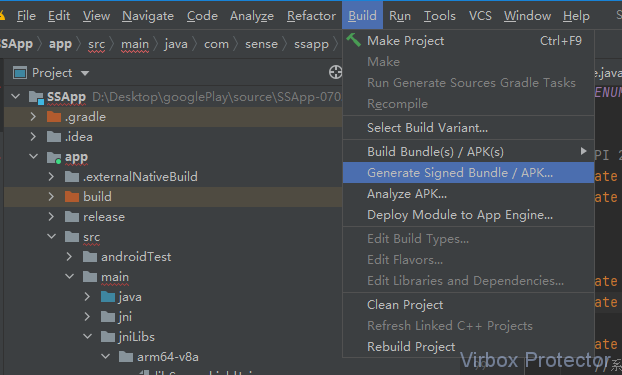
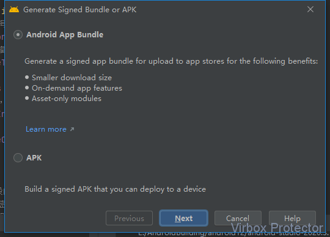
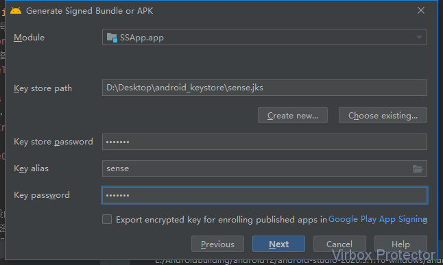
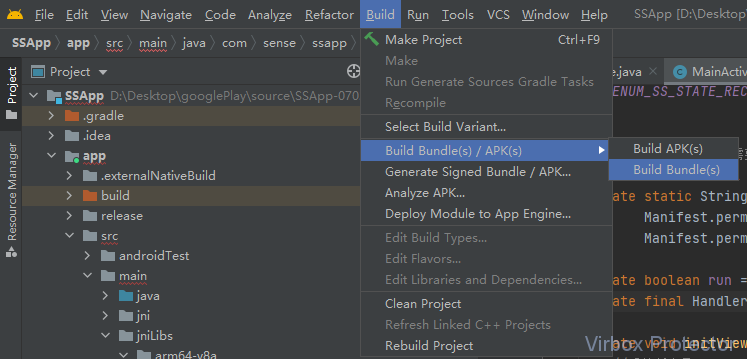
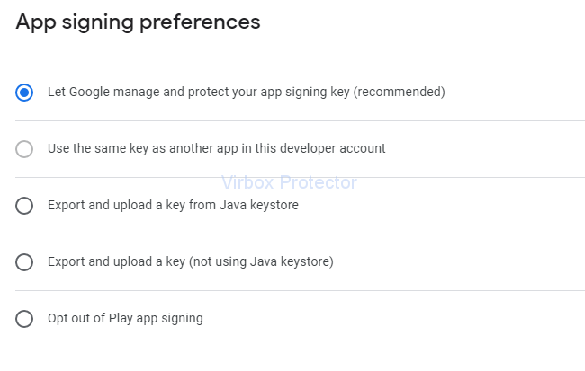
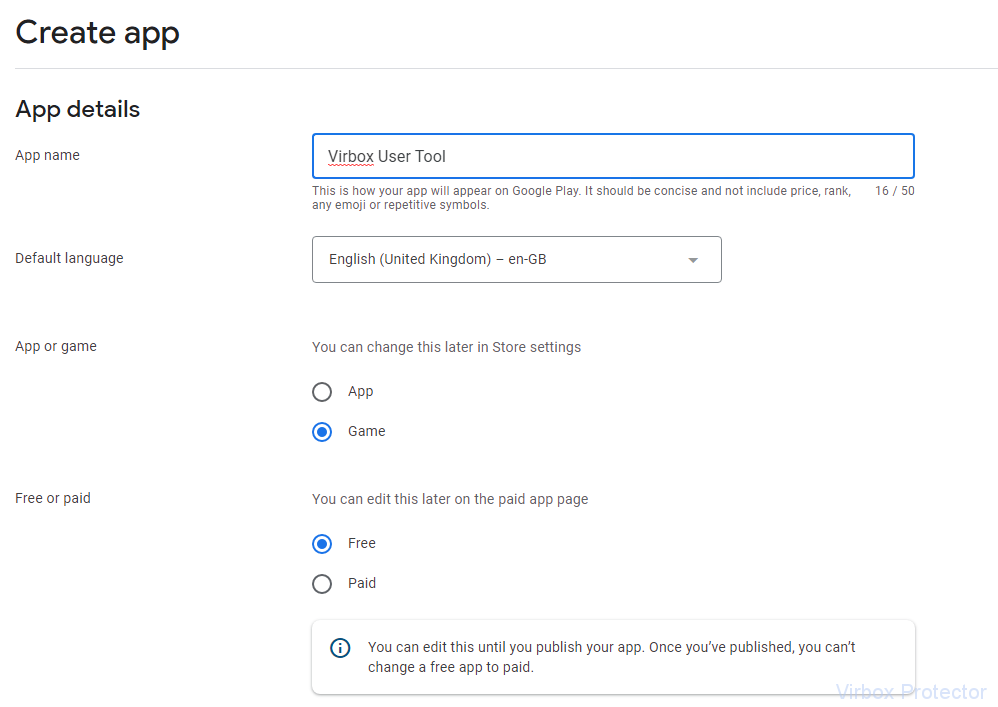
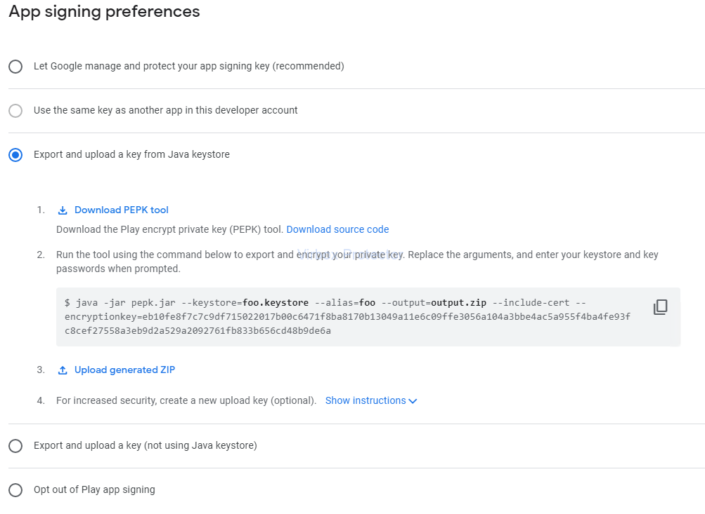

<<<<<<< HEAD
# How to Publish a AAB (Android App Bundles) to Google Play Store

Android App Bundle is new format to package your Android Apps and published in Google Play Store which start from August 2021, it is mandatory requirement for Google Play Store, compare with traditional Apk format, there are many advantage for both App developer and app user, the package size will be smaller for user when they download a app, and it is also not necessary for developer to build and manage multiple Apk package for the system in different architecture: ARM V7, V8, X86 ec.

The Packaging feature to AAB format for developer is available on Android studio 3.2.+; Developer can create a package in AAB format and upload your app package in AAB format to Google Play Store accordingly

And when user find the app they interested, they download the App and the device will automatically download the app base on their actual device architecture.

Here we briefing the process for how to package your app with AAB format and upload to Google Play Store.

### **Pre requisition:Build your app in AAB format**

Packaging feature available from Android Studio 3.2+, Select the Menu " Build->Generate Signed Bundle/APK"", as shown the snapshot below:

Select to build "AndroidApp Bundle", as shown the snapshot below, and click " Next"

Select your Signature file and input alias and key file (you can create a new one if not available), and click " Next", as shown the snapshot below:

> Note: you can use the signature provided by Google play store or use your own signature and key file, Here using your own signature and keystore file.

Click and select "Build->Build Bundle(s)/APK(s)->Build Bundle(s)", when build successful, the AAB package will be built accordingly.

Till now, you have complete the build process to AAB package. then you need to protect your AAB package by Virbox Protector before you publish your Apps. you may refer the User Manual "Protect AAB apps by use of Virbox Protector"

Before publish your apps to Google Play Store, you need to sign up and create a Developer account, we will quickly go through the signup process to create your developer account in next section.

### **Signup developer account in Google Play Store**

There many article briefing the signup process in Google play store, here we just list basic steps as follows, if you are familiar the process, you may skip this section and go to next section directly.

#### **Go to Google Play Developer console:**

https://play.google.com/apps/publish/signup

Sign up with your Google email
Read and agree the Google Play Developer Distribution agreement
Pay the registration fee for your developer account: US$ 25.00

> Note: you need to have one of card at least: VISA, Master, AE to pay registration fee
> Fill in and complete your Developer Account profile and then to complete whole signup process

### **Publish your AAB package to Google Play Store**

App Bundles is a new way to package an Android app, in fact, There is no big difference compare with previous process to publish your Apk project in Google Play Store, you can complete the whole publish process in Google Play Console. One thing you need to pay attention to select suitable and right "App signing" option according to your apps requirement. there are 5 options available before you upload your project:

you may select the key which Google provided (note, if you select to use Google key to sign you apps, then the key upload by yourself will be replaced by Google key, so, when you harden and protect your apps by yourself, you may not select to use your own key to sign the AAB. Since your own key signed after protection may conflict with Google key.

For the developer who use Virbox Protector to protect their AAB projects, if you would like to use Google key to sign your apps. Please don't click and select "Signature Check", see sample picture shown below:

#### **Create your apps in "Google Play Store"**

Use your Google developer account to sign in and open [Google Play Console](https://play.google.com/apps/publish)

here we use the sense.aab package as a example to show you publish process to Google play step by step. it is software tools for Android system. and

> `Default language`: English
> `App or Game`: App
> `Free or Paid`: Free

Select` "All apps > Create app"`, in Create App, select default language and input your App name, which it will appear on Google play.

Specify default language, App type (App or Game), it is free or paid according to your app. and also you need to add your email accept relevant Google policy and terms of service accordingly.

Last select Create app. to complete "Create app" process

here is example as shown below:

### **Setup your app on "App's dashboard"**

You need to entry the "Dashboard" which located in the left menu of "Google Play console" to set up your app. There are 2 part of content in the Dashboard you need to setup: Initial Setup and Release you app.

Initial Setup :

For this part of content, you may fill relevant information according to your app's content: app name, description and other information (email, app category) you need submit to Google store and upload graphic etc. follow up instruction to complete this process and nothing special.

> Note: For better focus to your target users, pls take look Google category and select correct category for your app, which is much helpful for you to get new user as much as possible after you release apps. same for you to add a right "tag" to your app also.

Release your app.:

You may follow up the Release your app process. nothing specially in whole process, you can use the testing provided by Google to test your app before formal publish.

One thing need to remind is App signing. Consider the signature in APP hardening, you may consider to use your own key and signing and not use Google signing. you can either to use Google manage & signing or use your own key signing, if so, you may consider to select your own key and signing in this section. for example, if you want to use the key store in java keystore, you can export the key and upload. see below selection.

> Note: The key must be the same key which you used to protect/harden your AAB project. keep consistency for keystore file and key.

### **Upload your AAB apps and release your apps.**

Upload your AAB file in the App Bundles and APKs section. Add a Release Name and Release Notes in the Release Details section.

Review and Release

New App Bundles and APKs will show any new APK or AAB files you have added to this release.

Release Notes will show the release notes for this release.

Click Start Rollout to Production to publish your app!

Once your app has been reviewed, it will go live on the Google Play Store.

We have quickly go through whole process for how to publish your AAB project on Google Play Store. We hope it is useful to help you publish a new AAB project to Google Play Store.

=======
# How to Publish a AAB (Android App Bundles) to Google Play Store

Android App Bundle is new format to package your Android Apps and published in Google Play Store which start from August 2021, it is mandatory requirement for Google Play Store, compare with traditional Apk format, there are many advantage for both App developer and app user, the package size will be smaller for user when they download a app, and it is also not necessary for developer to build and manage multiple Apk package for the system in different architecture: ARM V7, V8, X86 ec.

The Packaging feature to AAB format for developer is available on Android studio 3.2.+; Developer can create a package in AAB format and upload your app package in AAB format to Google Play Store accordingly

And when user find the app they interested, they download the App and the device will automatically download the app base on their actual device architecture.

Here we briefing the process for how to package your app with AAB format and upload to Google Play Store.

### **Pre requisition:Build your app in AAB format**

Packaging feature available from Android Studio 3.2+, Select the Menu " Build->Generate Signed Bundle/APK"", as shown the snapshot below:

Select to build "AndroidApp Bundle", as shown the snapshot below, and click " Next"

Select your Signature file and input alias and key file (you can create a new one if not available), and click " Next", as shown the snapshot below:

> Note: you can use the signature provided by Google play store or use your own signature and key file, Here using your own signature and keystore file.

Click and select "Build->Build Bundle(s)/APK(s)->Build Bundle(s)", when build successful, the AAB package will be built accordingly.

Till now, you have complete the build process to AAB package. then you need to protect your AAB package by Virbox Protector before you publish your Apps. you may refer the User Manual "Protect AAB apps by use of Virbox Protector"

Before publish your apps to Google Play Store, you need to sign up and create a Developer account, we will quickly go through the signup process to create your developer account in next section.

### **Signup developer account in Google Play Store**

There many article briefing the signup process in Google play store, here we just list basic steps as follows, if you are familiar the process, you may skip this section and go to next section directly.

#### **Go to Google Play Developer console:**

https://play.google.com/apps/publish/signup

Sign up with your Google email
Read and agree the Google Play Developer Distribution agreement
Pay the registration fee for your developer account: US$ 25.00

> Note: you need to have one of card at least: VISA, Master, AE to pay registration fee
> Fill in and complete your Developer Account profile and then to complete whole signup process

### **Publish your AAB package to Google Play Store**

App Bundles is a new way to package an Android app, in fact, There is no big difference compare with previous process to publish your Apk project in Google Play Store, you can complete the whole publish process in Google Play Console. One thing you need to pay attention to select suitable and right "App signing" option according to your apps requirement. there are 5 options available before you upload your project:

you may select the key which Google provided (note, if you select to use Google key to sign you apps, then the key upload by yourself will be replaced by Google key, so, when you harden and protect your apps by yourself, you may not select to use your own key to sign the AAB. Since your own key signed after protection may conflict with Google key.

For the developer who use Virbox Protector to protect their AAB projects, if you would like to use Google key to sign your apps. Please don't click and select "Signature Check", see sample picture shown below:

#### **Create your apps in "Google Play Store"**

Use your Google developer account to sign in and open [Google Play Console](https://play.google.com/apps/publish)

here we use the sense.aab package as a example to show you publish process to Google play step by step. it is software tools for Android system. and

> `Default language`: English
> `App or Game`: App
> `Free or Paid`: Free

Select` "All apps > Create app"`, in Create App, select default language and input your App name, which it will appear on Google play.

Specify default language, App type (App or Game), it is free or paid according to your app. and also you need to add your email accept relevant Google policy and terms of service accordingly.

Last select Create app. to complete "Create app" process

here is example as shown below:

### **Setup your app on "App's dashboard"**

You need to entry the "Dashboard" which located in the left menu of "Google Play console" to set up your app. There are 2 part of content in the Dashboard you need to setup: Initial Setup and Release you app.

Initial Setup :

For this part of content, you may fill relevant information according to your app's content: app name, description and other information (email, app category) you need submit to Google store and upload graphic etc. follow up instruction to complete this process and nothing special.

> Note: For better focus to your target users, pls take look Google category and select correct category for your app, which is much helpful for you to get new user as much as possible after you release apps. same for you to add a right "tag" to your app also.

Release your app.:

You may follow up the Release your app process. nothing specially in whole process, you can use the testing provided by Google to test your app before formal publish.

One thing need to remind is App signing. Consider the signature in APP hardening, you may consider to use your own key and signing and not use Google signing. you can either to use Google manage & signing or use your own key signing, if so, you may consider to select your own key and signing in this section. for example, if you want to use the key store in java keystore, you can export the key and upload. see below selection.

> Note: The key must be the same key which you used to protect/harden your AAB project. keep consistency for keystore file and key.

### **Upload your AAB apps and release your apps.**

Upload your AAB file in the App Bundles and APKs section. Add a Release Name and Release Notes in the Release Details section.

Review and Release

New App Bundles and APKs will show any new APK or AAB files you have added to this release.

Release Notes will show the release notes for this release.

Click Start Rollout to Production to publish your app!

Once your app has been reviewed, it will go live on the Google Play Store.

We have quickly go through whole process for how to publish your AAB project on Google Play Store. We hope it is useful to help you publish a new AAB project to Google Play Store.

>>>>>>> 8ae68f74b91666deb5c64e9e9861725607b56966
For more detail information, you may refer from official [Play Console Help](https://support.google.com/googleplay/android-developer#topic=)