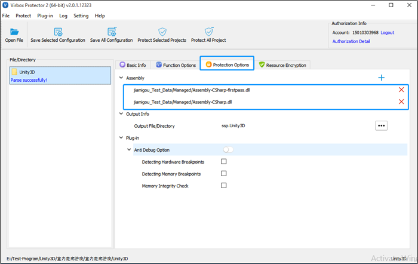
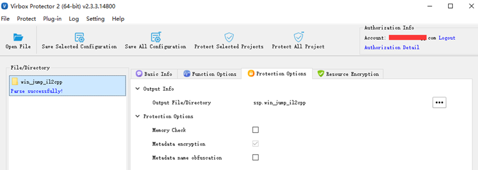
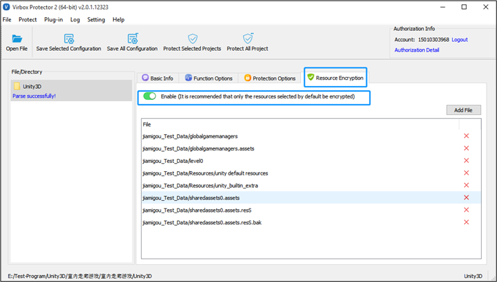
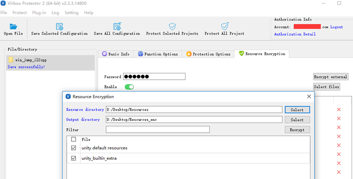
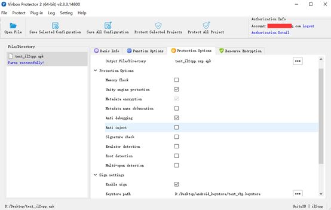

## Mechanism and execution process of Unity3D applications

Unity3D, as a cross platform engine, are widely used to develop different kind of software applications, Gaming & entertainment, 3D designing, Animation & Simulation, Construction, GIS, Arts & Education, Exhibition, Interior Decoration & Furniture area. Software developer may use Unity3D to build up their applications running and executed on Windows system, Android and iOS system accordingly.

Unity3D use C# language, As a scripting language, with the mcs, the C# compilier, it will transformed the C# into the intermediate language, the byte code, and then developer may use 2 ways to compile the byte code into the native code running in different operation system:

Mono framework, the mono VM doesn't compiled the IL to traditional exe file instead with compiled the IL to Csharp.dll, when Mono executed, the compilier will use JIT compilation mode to compile the byte code into the native code to execute. So it is different with the normal .NET/C# application and may not use the normal protection/obfuscation tool to protect it.

IL2CPP, recently it is more popular be used in Unity3D program due to highly execution performance and easy for cross platform, it will transform the IL into C++ code and then transform to native code to execute in Windows, Android or iOS system.

In addition to C++ code, Il2cpp generates metadata, which is saved as an external file: **global-metadata.dat**. It contains information for all runtime entities which used in the Unity3D application, including the names and types of all classes, methods and properties and the links between them, as well as all string literals, such as API keys, used in the C# code. The metadata is referenced from the generated C++ code and serves to link methods to their implementation.

Usually, it is not difficult for hacker to parse the **Assembly-CSharp.dll** **to crack and retrieve** C# code to create a fake Unity3D application by reverse engineering tools.

For IL2CPP, the hacker even may use the open source tool to parse and analysis the **global-metadata.dat** and retrieve the Unity3D applications.

So, from developer point of view, both critical file: **Assembly-CSharp.dll** & **global-metadata.dat** in the Unity3D applications need to be protected.

In addition, the Unity3D applications, both in mono and IL2CPP. contains large amount of data asset & resource, also need to be protected which to prevent these data resource being stolen and resued.

Also, Developer need to prevent the hacker to use debug tools to decompile apps.

Virbox Protector support to protect the Unity3D application for both Mono and IL2CPP mode. Here we briefed how does Virbox Protector to protect the Unity3D application in below section.

## Protection Mechanism, how does Virbox Protector protect the Unity3D application?

### 1. Protect the **Assembly-CSharp.dll &** glbal-net-data.dat

For Unity3D application in mono framework, Virbox Protector protect C# assembly (Assembly-CSharp.dll), to prevent C# decompiling and retrieve source code: Execute and open the Virbox Protector GUI tools, Drag the Unity3D apps into the Virbox Protector directly, Virbox Protector will parse and protect the **Assembly-CSharp-firstpass.dll** and **Assembly-CSharp.dll** on default. you may add the other customized C# assembly set in the /manage directory by "click".

For Unity3D application in IL2CPP, Virbox protector encrypt and protect the **glbal-net-data.dat**, to prevent multiple crack tool to dump the applications, such as IL2CPP dumper to dump related metadata information:

Comprehensive protection and encryption technology has been used: obfuscation, JIT encryption, etc.

### 2. Encrypt and Protect Asset Bundle

Virbox Protector support to protect Unity3D data asset and resource file (by encrypt Asset Bundle resource file) to prevent data resource be stolen and reuse by your competitor.

Hot Updated the Protected Resource file

In most of cases, Unity3D developer may update the Unity3D resource and need to re protect these updated resource frequently. Virbox Protector (By using the DS protector) supports to protect the Unity3D resource file with "external Protection" way, that means, Virbox(DS Protector) may protect these Resource file separately. and developer use the updated protected resource file to replace the old resource file. and it is not necessary for developer to protect both Unity3D program & resource file for every update to save developer's time.

(Hot Update: Support Mono framework in windows and Linux system only)

### 3. Prevent debugging, code injection, Memo dump

Virbox Protector has capable to prevent attacker to dump code in memo, via memo check, metadata encryption, metadata name obfuscation etc.

For Unity3D application in Android system, multiple protection option can be selected by one click. to enhance your Android APK security: Anti debugging, Anti Injection, Signature check, Emulator detection, Root detection etc.

Virbox Protector provides 2 ways to protect Unity3D applications, GUI tool and CLI mode.

Developer may select and combine to use above protection option to protect your Unity3D application accordingly.

You may apply trial to download Virbox Protector (Unity3D license) to test, protect and evaluate the protection performance to your Unity3D application now.

https://appsecurity.virbox.com/apply.html

contact us to get more information and technical support at:

email: [info@senselock.com](mailto:info@senselock.com)

Skype: [virbox_help@outlook.com](mailto:virbox_help@outlook.com)
